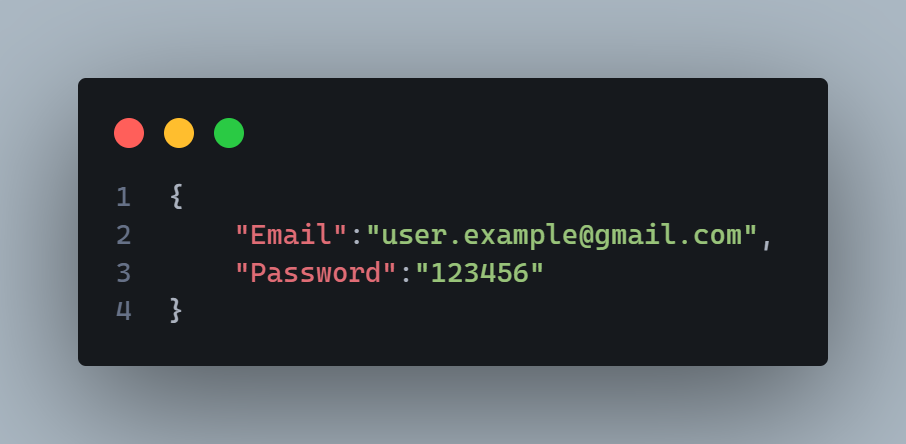

# 🎭 Characters.API

📌 **Characters.API** is a RESTful API for managing characters and movies, built with **Node.js**, **Express** and **SQL Server**. It includes secure authentication, data validation, performance optimization, enhanced security, and comprehensive API documentation.

## 🚀 Installation Guide
### 1️⃣ Clone the repository:
~~~
git clone https://github.com/TochuGV/Characters.API.git
cd Characters.API
~~~
### 2️⃣ Install dependencies:
~~~
npm install
~~~
### 3️⃣ Set up the environment variables:
- Create a `.env` file in the root directory.
- Copy and paste the following template, then replace the values with your own:

```
###############################
#  🌐 DATABASE CONFIGURATION  #
###############################
DB_USER=your_database_user            # 👤 Database username          
DB_PASSWORD=your_database_password    # 🔑 Database password
DB_SERVER=your_database_server        # 🖥️ Database server address
DB_NAME=your_database_name            # 📂 Database name

########################
#  📌 DATABASE TABLES  #
########################
DB_CHARACTER_TABLE=your_character_table_name                    # 🎭 Table for characters
DB_MOVIE_TABLE=your_movie_table_name                            # 🎬 Table for movies
DB_CHARACTERSXMOVIES_TABLE=your_charactersxmovies_table_name    # 🔗 Relationship table (characters & movies)
DB_USER_TABLE=your_user_table_name                              # 👥 Table for users

##############################
#  🚀 SERVER CONFIGURATION   #
##############################
PORT=your_port    # 🔌 Server port

####################
#  🔐 SECURITY    #
####################
JWT_SECRET_KEY=your_jwt_secret_key    # 🛡️ Use a secure key and store it safely!

##################################
#  ⏳ RATE LIMIT CONFIGURATION   #
##################################
RATE_LIMIT_WINDOW=your_rate_limit_window    # ⏲️ Time window (minutes)
RATE_LIMIT_MAX=your_rate_limit_max          # 🚦 Max requests per window  

###################################
#  📦 COMPRESSION CONFIGURATION  #
###################################
COMPRESSION_THRESHOLD=your_compression_threshold    # 📏 Min size in bytes to compress responses
COMPRESSION_LEVEL=your_compression_level            # 🔽 Compression level (0-9)

##############################
#  ⚡ CACHE CONFIGURATION   #
##############################
CACHE_TTL=your_cache_ttl                      # ⏳ Cache lifetime in seconds
CACHE_CHECK_PERIOD=your_cache_check_period    # 🔄 Interval to clear the cache in seconds
```

>[!IMPORTANT]
>Before starting the server, make sure to execute the `script.sql` file inside your **SQL Server** database.
>This will create the required tables and relationships for the API to function correctly.

### 4️⃣ Start the server:
~~~
npm start
~~~
✅ The API should now be running on `http://localhost:your_port`.

## 🛠 Tecnologies Used

| Category               | Technologies |
|------------------------|--------------|
| **Backend Framework**  | [Express](https://expressjs.com/) - Fast and minimalist web framework for Node.js. |
| **Authentication & Security** | [jsonwebtoken](https://www.npmjs.com/package/jsonwebtoken) - Secure authentication with JWT. <br> [bcrypt](https://www.npmjs.com/package/bcrypt) - Password hashing. <br> [helmet](https://www.npmjs.com/package/helmet) - Security headers protection. <br> [cors](https://www.npmjs.com/package/cors) - CORS management. <br> [express-rate-limit](https://www.npmjs.com/package/express-rate-limit) - Rate limiting. <br> [cookie-parser](https://www.npmjs.com/package/cookie-parser) - Cookie handling. <br> [passport](https://www.npmjs.com/package/passport) & [passport-jwt](https://www.npmjs.com/package/passport-jwt) - Authentication middleware. |
| **Data Validation** | [Zod](https://www.npmjs.com/package/zod) - Schema-based validation. |
| **Database** | [mssql](https://www.npmjs.com/package/mssql) - SQL Server integration. |
| **Performance Optimization** | [node-cache](https://www.npmjs.com/package/node-cache) - In-memory caching. <br> [compression](https://www.npmjs.com/package/compression) - Response compression. |
| **API Documentation** | [swagger-ui-express](https://www.npmjs.com/package/swagger-ui-express) - API documentation and testing. |

## 📂 Project Structure

```
📂src
├──📂cache
├──📂common
    ├──📂errors
├──📂config
├──📂controllers
├──📂database
├──📂middlewares
├──📂routes
├──📂schemas
├──📂services
├──📂swagger
    ├──📂components
    ├──📂paths
├──📂utils
📂assets
├──📂images
📂postman
```

## 📌 Endpoints

### 🎭 Characters

| Method | Endpoint          | Description                                                                                  |
|--------|-------------------|----------------------------------------------------------------------------------------------|
| GET    | `/characters`     | Get all characters (supports filtering by `name`, `age`, `weight`, `movie`, `page`, `limit`) |
| GET    | `/characters/:id` | Get character by ID                                                                          |
| POST   | `/characters`     | Create a new character                                                                       |
| PUT    | `/characters/:id` | Update an existing character                                                                 |
| DELETE | `/characters/:id` | Delete a character                                                                           |

### 🎬 Movies

| Method | Endpoint      | Description                                                               |
|--------|---------------|---------------------------------------------------------------------------|
| GET    | `/movies`     | Get all movies (supports filtering by `title`, `order`, `page`, `limit`)) |
| GET    | `/movies/:id` | Get movie by ID                                                           |
| POST   | `/movies`     | Create a new movie                                                        |
| PUT    | `/movies/:id` | Update an existing movie                                                  |
| DELETE | `/movies/:id` | Delete a movie                                                            |

### 🔐 Authentication

| Method | Endpoint         | Description             |
|--------|------------------|-------------------------|
| POST   | `/auth/register` | Register a new user     |
| POST   | `/auth/login`    | Login an existing user  |
| POST   | `/auth/logout`   | Logout the current user |

> [!NOTE]  
> The full API documentation can be found at [http://localhost:3000/api-docs](http://localhost:3000/api-docs). This includes all available endpoints, query parameters, request bodies, and responses.

## 🔐 Authentication

### 1️⃣ User Registration:

📌 **Endpoint:** `POST /auth/register`<br>
📌 **Description:** Creates a new user with an encrypted password.

- **Request Body**


### 2️⃣ User Login:

📌 **Endpoint:** `POST /auth/login`<br>
📌 **Description:** Authenticates the user and returns a JWT token in an HTTP-only cookie.

### 3️⃣ Accessing Protected Routes:


### 4️⃣ Token Expiration & Refresh:

### 5️⃣ User Logout:

📌 **Endpoint:** `POST /auth/logout`<br>
📌 **Description:** Clears the authentication cookie, logging the user out.
