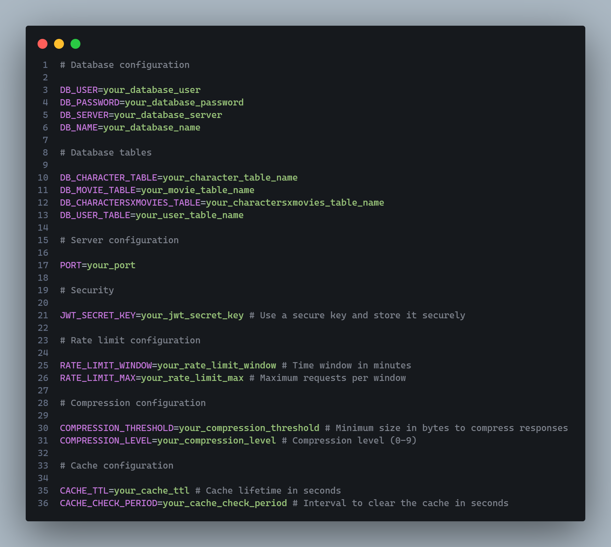

# 🎭 Characters.API

📌 **Characters.API** is a RESTful API for managing characters and movies, built with **Node.js**, **Express** and **SQL Server**. It includes secure authentication, data validation, performance optimization, enhanced security, and comprehensive API documentation.

## 🚀 Installation Guide
### 1️⃣ Clone the repository:
~~~
git clone https://github.com/TochuGV/Characters.API.git
cd Characters.API
~~~
### 2️⃣ Install dependencies:
~~~
npm install
~~~
### 3️⃣ Set up the environment variables:
- Create a `.env` file in the root directory.
- Copy and paste the following template, then replace the values with your own:

```
# Database configuration
DB_USER=your_database_user
DB_PASSWORD=your_database_password
DB_SERVER=your_database_server
DB_NAME=your_database_name

# Database tables
DB_CHARACTER_TABLE=your_character_table_name
DB_MOVIE_TABLE=your_movie_table_name
DB_CHARACTERSXMOVIES_TABLE=your_charactersxmovies_table_name
DB_USER_TABLE=your_user_table_name

# Server configuration
PORT=your_port

# Security
JWT_SECRET_KEY=your_jwt_secret_key # Use a secure key and store it securely

# Rate limit configuration
RATE_LIMIT_WINDOW=your_rate_limit_window # Time window in minutes
RATE_LIMIT_MAX=your_rate_limit_max # Maximum requests per window

# Compression configuration
COMPRESSION_THRESHOLD=your_compression_threshold # Minimum size in bytes to compress responses
COMPRESSION_LEVEL=your_compression_level # Compression level (0-9)

# Cache configuration
CACHE_TTL=your_cache_ttl # Cache lifetime in seconds
CACHE_CHECK_PERIOD=your_cache_check_period # Interval to clear the cache in seconds
```
<!---->

### 4️⃣ Start the server:
~~~
npm start
~~~
✅ The API should now be running on `http://localhost:your_port`.

## 🛠 Tecnologies Used

| Category               | Technologies |
|------------------------|--------------|
| **Backend Framework**  | [Express](https://expressjs.com/) - Fast and minimalist web framework for Node.js. |
| **Authentication & Security** | [jsonwebtoken](https://www.npmjs.com/package/jsonwebtoken) - Secure authentication with JWT. <br> [bcrypt](https://www.npmjs.com/package/bcrypt) - Password hashing. <br> [helmet](https://www.npmjs.com/package/helmet) - Security headers protection. <br> [cors](https://www.npmjs.com/package/cors) - CORS management. <br> [express-rate-limit](https://www.npmjs.com/package/express-rate-limit) - Rate limiting. <br> [cookie-parser](https://www.npmjs.com/package/cookie-parser) - Cookie handling. <br> [passport](https://www.npmjs.com/package/passport) & [passport-jwt](https://www.npmjs.com/package/passport-jwt) - Authentication middleware. |
| **Data Validation** | [Zod](https://www.npmjs.com/package/zod) - Schema-based validation. |
| **Database** | [mssql](https://www.npmjs.com/package/mssql) - SQL Server integration. |
| **Performance Optimization** | [node-cache](https://www.npmjs.com/package/node-cache) - In-memory caching. <br> [compression](https://www.npmjs.com/package/compression) - Response compression. |
| **API Documentation** | [swagger-ui-express](https://www.npmjs.com/package/swagger-ui-express) - API documentation and testing. |

## 📂 Project Structure

```
📂src
├──📂cache
├──📂common
    ├──📂errors
├──📂config
├──📂controllers
├──📂database
├──📂middlewares
├──📂routes
├──📂schemas
├──📂services
├──📂swagger
    ├──📂components
    ├──📂paths
├──📂utils
```

## 📌 Endpoints

<!--
| Endpoint      | Description |
|---------------|-------------|
|`GET /characters`| Get all characters |
|`GET /characters/:id`| Get all characters |
|`POST /characters`| Get all characters |
|`PUT /characters/:id`| Get all characters |
|`DELETE /characters/:id`| Get all characters |
|`GET/movies`| Get all characters |
|`GET/movies/:id`| Get all characters |
|`GET/movies`| Get all characters |
|`GET/movies/:id`| Get all characters |
|`GET/movies/:id`| Get all characters | -->

<!--
🎭 Personajes
✔️ GET /characters → Obtiene todos los personajes.
✔️ GET /characters/:id → Obtiene un personaje por ID.
✔️ POST /characters → Crea un nuevo personaje.
✔️ PUT /characters/:id → Modifica un personaje.
✔️ DELETE /characters/:id → Elimina un personaje.

🎬 Películas
✔️ GET /movies → Obtiene todas las películas.
✔️ GET /movies/:id → Obtiene una película por ID.
✔️ POST /movies → Crea una nueva película.
✔️ PUT /movies/:id → Modifica una película.
✔️ DELETE /movies/:id → Elimina una película.

📌 Para más detalles, consulta la documentación de Swagger en:

bash
Copy
Edit
http://localhost:3000/api-docs-->

## 🔐 Authentication

### 1️⃣ User Registration:

📌 **Endpoint:** `POST /auth/register`<br>
📌 **Description:** Creates a new user with an encrypted password.

### 2️⃣ User Login:

📌 **Endpoint:** `POST /auth/login`<br>
📌 **Description:** Authenticates the user and returns a JWT token in an HTTP-only cookie.

### 3️⃣ Accessing Protected Routes:


### 4️⃣ Token Expiration & Refresh:

### 5️⃣ User Logout:

📌 **Endpoint:** `POST /auth/logout`<br>
📌 **Description:** Clears the authentication cookie, logging the user out.

<!--It provides: 
- **Secure authentication** with `jsonwebtoken` and `bcrypt` for password hashing.
- **Data validation** using `Zod` to ensure correct input handling.
- **Performance optimization**, including caching with `node-cache` and response compression with `compression`.
- **Security enhancements** using `helmet`, `cors` for CORS management, and `express-rate-limit` for rate limiting.
- **Database integration** with `mssql` for seamless SQL Server interaction.
- **API documentation** with `swagger-ui-express`.
- **Cookie handling** with `cookie-parser` and authentication support via `passport` and `passport-jwt`.-->
