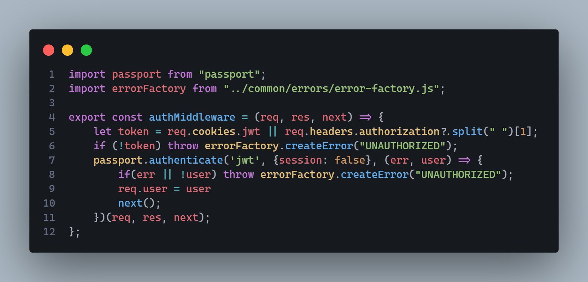
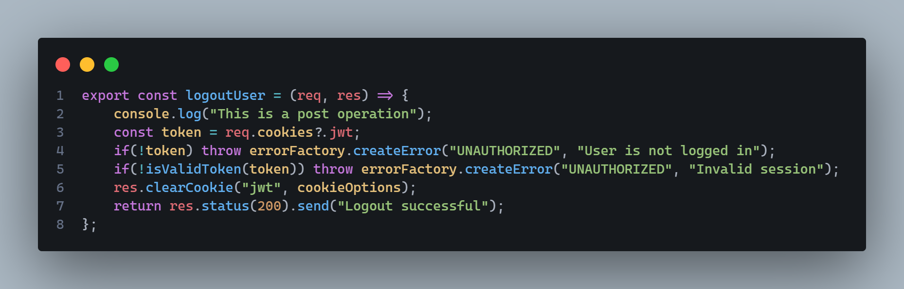

# 🎭 Characters.API

> [!WARNING]
> **Documentation Outdated:** This project has been recently refactored, but this README still reflects the old architecture (March 2025). Updates coming soon.

📌 **Characters.API** is a RESTful API for managing characters and movies, built with **Node.js**, **Express** and **SQL Server**. It includes secure authentication, data validation, performance optimization, enhanced security, and comprehensive API documentation.

## 🚀 Installation Guide
### 1️⃣ Clone the repository:
~~~
git clone https://github.com/TochuGV/Characters.API.git
cd Characters.API
~~~
### 2️⃣ Install dependencies:
~~~
npm install
~~~
### 3️⃣ Set up the environment variables:
- Create a `.env` file in the root directory.
- Copy and paste the following template, then replace the values with your own:


>[!IMPORTANT]
>Before starting the server, make sure to execute the `script.sql` file inside your **SQL Server** database.
>This will create the required tables and relationships for the API to function correctly.

### 4️⃣ Start the server:
~~~
npm start
~~~
✅ The API should now be running on `http://localhost:your_port`.

## 🛠 Tecnologies Used

| Category               | Technologies |
|------------------------|--------------|
| **Backend Framework**  | [Express](https://expressjs.com/) - Fast and minimalist web framework for Node.js. |
| **Authentication & Security** | [jsonwebtoken](https://www.npmjs.com/package/jsonwebtoken) - Secure authentication with JWT. <br> [bcrypt](https://www.npmjs.com/package/bcrypt) - Password hashing. <br> [helmet](https://www.npmjs.com/package/helmet) - Security headers protection. <br> [cors](https://www.npmjs.com/package/cors) - CORS management. <br> [express-rate-limit](https://www.npmjs.com/package/express-rate-limit) - Rate limiting. <br> [cookie-parser](https://www.npmjs.com/package/cookie-parser) - Cookie handling. <br> [passport](https://www.npmjs.com/package/passport) & [passport-jwt](https://www.npmjs.com/package/passport-jwt) - Authentication middleware. |
| **Data Validation** | [Zod](https://www.npmjs.com/package/zod) - Schema-based validation. |
| **Database** | [mssql](https://www.npmjs.com/package/mssql) - SQL Server integration. |
| **Performance Optimization** | [node-cache](https://www.npmjs.com/package/node-cache) - In-memory caching. <br> [compression](https://www.npmjs.com/package/compression) - Response compression. |
| **API Documentation** | [swagger-ui-express](https://www.npmjs.com/package/swagger-ui-express) - API documentation and testing. |

## 📂 Project Structure

```
📂src
├──📂cache              # 🗄️ Cache initilization
├──📂common             # ⚙️ Shared utilities and configurations
|  ├──📂errors          # ❌ Custom error handling
├──📂config             # 🛠️ Configuration files 
├──📂controllers        # 🎮 Request handlers that process HTTP requests and call services
├──📂database           # 🏛️ Database connection setup and initilization
├──📂middlewares        # 🚦 Middleware definitions
├──📂routes             # 🛤️ Route definitions
├──📂schemas            # 📜 Validation schemas using Zod
├──📂services           # 🏗️ Business logic and database interacions
├──📂swagger            # 📑 Swagger documentation
|    ├──📂components    # 🧩 Components like schemas and responses
|    ├──📂paths         # 🛣️ Path definitions for each endpoint
├──📂utils              # 🧰 Helper functions and reusable utilities
📂postman               # 📮 Postman collections for testing endpoints
📂assets                # 🖼️ Static resources (images, logos, etc.)
├──📂images             # 📸 Screenshots of code or illustrations
```

## 📌 Endpoints

### 🎭 Characters

| Method | Endpoint          | Description                                                                                  |
|--------|-------------------|----------------------------------------------------------------------------------------------|
| GET    | `/characters`     | Get all characters (supports filtering by `name`, `age`, `weight`, `movie`, `page`, `limit`) |
| GET    | `/characters/:id` | Get character by ID                                                                          |
| POST   | `/characters`     | Create a new character                                                                       |
| PUT    | `/characters/:id` | Update an existing character                                                                 |
| DELETE | `/characters/:id` | Delete a character                                                                           |

### 🎬 Movies

| Method | Endpoint      | Description                                                               |
|--------|---------------|---------------------------------------------------------------------------|
| GET    | `/movies`     | Get all movies (supports filtering by `title`, `order`, `page`, `limit`)  |
| GET    | `/movies/:id` | Get movie by ID                                                           |
| POST   | `/movies`     | Create a new movie                                                        |
| PUT    | `/movies/:id` | Update an existing movie                                                  |
| DELETE | `/movies/:id` | Delete a movie                                                            |

### 🔐 Authentication

| Method | Endpoint         | Description             |
|--------|------------------|-------------------------|
| POST   | `/auth/register` | Register a new user     |
| POST   | `/auth/login`    | Login an existing user  |
| POST   | `/auth/logout`   | Logout the current user |

> [!NOTE]  
> The full API documentation can be found at [http://localhost:3000/api-docs](http://localhost:3000/api-docs). This includes all available endpoints, query parameters, request bodies, and responses.

## 🔐 Authentication

### 1️⃣ User Registration:

📌 **Endpoint:** `POST /auth/register`<br>
📌 **Description:** Creates a new user with an encrypted password.

📍 **Request Body:**
~~~
{
  "Email": "user.example@gmail.com",
  "Password": 123456
}
~~~

### 2️⃣ User Login:

📌 **Endpoint:** `POST /auth/login`<br>
📌 **Description:** Authenticates the user and returns a JWT token in an HTTP-only cookie. Because of this cookie's attribute, it means it's not accessible to JavaScript running in the browser.

📍 **Request Body:**
~~~
{
  "Email": "user.example@gmail.com",
  "Password": 123456
}
~~~

### 3️⃣ Accessing Protected Routes:

📌 **Description:** To access protected routes, the user must send the JWT token in their HTTP request. This is validated using a middleware that checks the presence of the token in the cookie or in the Authorization Header.

This is the middleware mentioned above:



### 4️⃣ Token Expiration & Refresh:

📌 **Description:** Tokens have an expiration time. Once expired, users need to re-authenticate.

### 5️⃣ User Logout:

📌 **Endpoint:** `POST /auth/logout`<br>
📌 **Description:** Clears the authentication cookie, logging the user out.



## 🌱 Future Improvements

- [ ] 🔐 Implement roles and permissions for users.
- [ ] 📊 Add logs and monitoring to the API.
- [ ] 🔑 Implement access and refresh tokens for enhanced security.
- [ ] 📌 Implement automated tests.
- [ ] 📄 More detailed documentation of the endpoints in Swagger.
- [ ] 🗄️ Improve error handling with more specific error codes, especially for SQL Server database errors.
