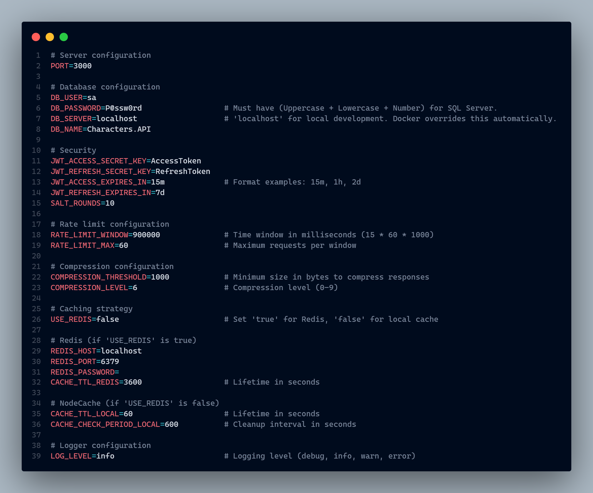

# 🎭 Characters.API

📌 **Characters.API** is a **production-grade** RESTful API for managing characters and movies, built with **Node.js**, **Express**, **Prisma**, and **SQL Server**. It features secure JWT authentication, Redis caching, comprehensive testing, and full Docker containerization.

---

## 🚀 Getting Started

### 📋 Prerequisites

You need **[Docker](https://docs.docker.com/get-docker/)** and **[Docker Compose](https://docs.docker.com/compose/install/)** installed.

Verify your installation:
```bash
# Required for all setups
docker --version        # Docker version 20.x or higher
docker compose version  # Docker Compose version 2.x or higher
```

> [!NOTE]
> **[Node.js 20+](https://nodejs.org/)** (v22 recommended) is only required for local development (see [Local Development](#-local-development-optional)).

---

## ⚡ Quick Start (Recommended)

Run the full application stack without cloning the source code using Docker.

### 1️⃣ Create the compose file:

Create a new folder and inside it, create a file named `docker-compose.yml` with the following content:

```yaml
services:
  api:
    image: tochugv/characters-api:latest
    container_name: characters_api_server
    ports:
      - "3000:3000"
    environment:
      # --- Server configuration ---
      - NODE_ENV=production
      - PORT=3000
          
      # --- Database configuration ---
      - DB_SERVER=sqlserver
      - DB_NAME=Characters.API
      - DB_USER=sa
      - DB_PASSWORD=P@ssw0rd
          
      # --- Security ---
      - JWT_ACCESS_SECRET_KEY=AccessToken
      - JWT_REFRESH_SECRET_KEY=RefreshToken
      - JWT_ACCESS_EXPIRES_IN=15m
      - JWT_REFRESH_EXPIRES_IN=7d
      - SALT_ROUNDS=10

      # --- Rate limit configuration ---
      - RATE_LIMIT_WINDOW=900000
      - RATE_LIMIT_MAX=60

      # --- Compression configuration ---
      - COMPRESSION_THRESHOLD=1000
      - COMPRESSION_LEVEL=6
          
      # --- Caching (Redis enabled) ---
      - USE_REDIS=true
      - REDIS_HOST=redis
      - REDIS_PORT=6379
      - CACHE_TTL_REDIS=3600
      - CACHE_TTL_LOCAL=60
      - CACHE_CHECK_PERIOD_LOCAL=600

      # --- Logging ---
      - LOG_LEVEL=info

    depends_on:
      sqlserver:
        condition: service_healthy
      redis:
        condition: service_started
    networks:
      - app_network

  sqlserver:
    image: mcr.microsoft.com/mssql/server:2022-latest
    container_name: characters_api_sqlserver
    environment:
      - ACCEPT_EULA=Y
      - SA_PASSWORD=P@ssw0rd
      - MSSQL_PID=Developer
    ports:
      - "1433:1433"
    volumes:
      - sqlserver_data:/var/opt/mssql
    healthcheck:
      test: /opt/mssql-tools18/bin/sqlcmd -S localhost -U sa -P P@ssw0rd -Q "SELECT 1" -C
      interval: 10s
      timeout: 5s
      retries: 10
      start_period: 30s
    networks:
      - app_network

  redis:
    image: redis:alpine
    container_name: characters_api_redis
    ports:
      - "6379:6379"
    volumes:
      - redis_data:/data
    networks:
      - app_network

  redis_commander:
    image: rediscommander/redis-commander:latest
    container_name: redis_ui
    environment:
      - REDIS_HOSTS=local:redis:6379
    ports:
      - "8081:8081"
    depends_on:
      - redis
    networks:
      - app_network

volumes:
  sqlserver_data:
  redis_data:

networks:
  app_network:
    driver: bridge
```

> [!WARNING]
> **Security Notice:** The JWT secrets above (`AccessToken`, `RefreshToken`) are for **testing purposes only**.  
> For production, use strong random secrets with at least 32 characters.

### 2️⃣ Run the stack:

Open your terminal in that folder and run:

```bash
docker compose up -d
```

**What happens:**
- Docker pulls the API image from [**Docker Hub**](https://hub.docker.com/r/tochugv/characters-api)
- SQL Server starts and initializes
- Database migrations run automatically
- Seed data is inserted

**Monitor the startup (Optional):**

Open a second terminal and run:
```bash
# For Unix systems (Linux/macOS) or Git Bash:
docker compose logs -f sqlserver | grep -i "ready for client connections"

# For Windows (PowerShell):
docker compose logs -f sqlserver | Select-String "ready for client connections"
```

Look for: `SQL Server is now ready for client connections`

> [!NOTE]
> First startup: 30-60 seconds. <br>
> Subsequent starts: ~5 seconds.

### 3️⃣ Verify it's running:

Once all containers are up, you can access:

| Service | URL |
| :--- | :--- |
| 🚀 **API** | [http://localhost:3000](http://localhost:3000) |
| 📚 **API Documentation (Swagger)** | [http://localhost:3000/api-docs](http://localhost:3000/api-docs) |
| ❤️ **Health Check** | [http://localhost:3000/health](http://localhost:3000/health) |
| 📊 **Metrics** | [http://localhost:3000/metrics](http://localhost:3000/metrics) |
| 🔴 **Redis Commander (GUI)** | [http://localhost:8081](http://localhost:8081) |

> [!TIP]
> Visit **[http://localhost:3000/health](http://localhost:3000/health)** to verify the API is running.  
> For complete testing, use the interactive **[Swagger UI](http://localhost:3000/api-docs)** or clone the repository to access the **Postman collection**.

#### 🛑 Stop the stack

To stop the containers, run:

```bash
# Stop containers keeping data:
docker compose down

# Complete cleanup:
docker compose down -v
```

> [!WARNING]
> The `-v` flag removes all database data, users, and characters. Use only if you want to start fresh.

---

## 💻 Local Development (Optional)

> [!NOTE]
> This section is for developers who want to **modify the source code** and see changes in real-time.  
> The recommended setup uses Docker for infrastructure (SQL Server + Redis) and runs only the Node.js API locally.

### 📋 Prerequisites for Local Development

You need **[Node.js 22+](https://nodejs.org/)** installed.

Verify your installation:
```bash
node --version   # v22.x or higher (optional)
npm --version    # 10.x or higher (optional)
```

### 1️⃣ Clone the repository:

```bash
git clone https://github.com/TochuGV/Characters.API.git
cd Characters.API
```

### 2️⃣ Install dependencies:

```bash
npm install
```

### 3️⃣ Set up environment variables:

Create your `.env` file from the example:
```bash
cp .env.example .env
```

> [!TIP]
> The default values in `.env.example` work out-of-the-box with Docker services.  
> Only modify them if you need custom ports or different passwords.

**Environment variables overview:**



### 4️⃣ Start infrastructure services:

```bash
npm run services:up
```

### 5️⃣ Run database migrations and seed

```bash
npm run prisma:migrate
npm run prisma:seed
```

### 6️⃣ Start the development server

```bash
npm run dev
```

✅ The API should now be running on `http://localhost:3000` with auto-reload enabled.

---

## 🛠️ Tech Stack

| Category | Technology | Purpose |
| :--- | :--- | :--- |
| **Core** | [**Node.js**](https://nodejs.org/) / [**Express**](https://expressjs.com/) | Main runtime and web framework. |
| **Database & ORM** | [**Prisma**](https://www.prisma.io/) / [**SQL Server**](https://www.microsoft.com/sql-server) | Type-safe ORM and relational database. |
| **Validation** | [**Zod**](https://zod.dev/) | Schema validation and strict type inference. |
| **Authentication** | [**Passport**](https://www.passportjs.org/) / [**JWT**](https://jwt.io/) | Hybrid Auth (Stateless Access + Stateful Refresh). |
| **Security** | [**Helmet**](https://helmetjs.github.io/) / [**Bcrypt**](https://www.npmjs.com/package/bcrypt) <br> [**Cookie Parser**](https://www.npmjs.com/package/cookie-parser) | HTTP headers hardening and password hashing. <br> Secure HTTP-Only cookie parsing. |
| **Caching** | [**Redis**](https://redis.io/) / [**NodeCache**](https://www.npmjs.com/package/node-cache) | Hybrid caching strategy (Distributed vs. In-Memory). |
| **Logging** | [**Pino**](https://getpino.io/) | High-performance, low-overhead structured logging. |
| **Performance** | [**Compression**](https://www.npmjs.com/package/compression) <br> [**Rate Limit**](https://www.npmjs.com/package/express-rate-limit) | Gzip response compression for lower latency. <br> DDOS protection and traffic control. |
| **Testing** | [**Jest**](https://jestjs.io/) / [**Supertest**](https://www.npmjs.com/package/supertest) | Integration testing for API endpoints. |
| **Infrastructure** | [**Docker**](https://www.docker.com/) / [**Docker Compose**](https://docs.docker.com/compose/) | Containerization and local service orchestration. |
| **Documentation** | [**Swagger UI**](https://swagger.io/tools/swagger-ui/) | Interactive API documentation and testing interface. |

---

## 🏗️ Architecture & Design Decisions

> [!IMPORTANT]  
> **Production-Grade Simulation:** Although this project is a portfolio demonstration and not intended for a live production environment, it was engineered following **industry-standard best practices**, focusing on scalability, security, and maintainability as if it were a real-world critical system.

### 📐 Architectural Style
The project follows a **Layered Architecture** where **Dependency Injection** is used to decouple components. A centralized `Container` injects Repositories into Services, and Services into Controllers, ensuring modularity and testability.

* **Controllers:** Handle HTTP requests, parsing, and response formatting.
* **Services:** Encapsulate business logic, ensuring that rules are applied consistently.
* **Repositories (DAL):** Abstract the data access layer. The rest of the application is agnostic to the underlying database implementation (Prisma/SQL Server).
* **Schemas (DTO):** Strict schema validation ensures that only valid data reaches the service layer.

### 🧩 Design Patterns
Specific technical solutions implemented to solve common problems:
| Pattern | Type | Implementation & Usage |
| :--- | :--- | :--- |
| **Singleton** | *Creational* | Ensures a single instance for `PrismaClient`, `Logger`, and the `CacheManager`. |
| **Factory Method** | *Creational* | Implemented in `ErrorFactory` to standardize error object creation across the app. |
| **Adapter** | *Structural* | The `CacheManager` acts as an adapter, unifying `Redis` and `Node-Cache` interfaces into a single API. |
| **Chain of Responsibility**| *Behavioral*| Utilized by **Express Middleware** pipeline (Auth, Validation, Error Handling) to process requests sequentially. |
| **Strategy** | *Behavioral* | Implemented via **Passport.js** to handle authentication logic (JWT Strategy) interchangeable with other methods. |

### ⚡ Hybrid Caching Strategy
A custom **Dual-Layer Caching System** implementing the **Fallback Pattern**:
1.  **Primary Layer (Redis):** Distributed cache ideal for production environments.
2.  **Fallback Layer (In-Memory):** If Redis is unavailable or disabled (e.g., local development), the system automatically downgrades to `node-cache` (RAM).

>[!NOTE]
> This ensures the API remains fast and resilient even if the external cache service fails.

### 🔄 Idempotency
To prevent duplicate resource creation during network retries, **Idempotency** is implemented on critical `POST` endpoints.

**How it works:**<br>
1️⃣ Client includes a unique `Idempotency-Key` header in the request.<br>
2️⃣ First request executes normally and response is cached for **24 hours**.<br>
3️⃣ Subsequent requests with the same key return the cached response instantly.

**Example:**
```bash
curl -X POST http://localhost:3000/characters \
  -H "Authorization: Bearer YOUR_TOKEN" \
  -H "Idempotency-Key: char-creation-12345" \
  -H "Content-Type: application/json" \
  -d '{
    "name": "Woody",
    "image": "https://example.com/woody.jpg",
    "age": 50,
    "weight": 0.5,
    "story": "Sheriff Woody Pride is a vintage toy cowboy."
  }'
```

> [!NOTE]
> See [Domain Resources](#-domain-resources) for complete endpoint documentation.

### 🩺 Observability

The API includes built-in monitoring capabilities for production reliability:

- **Health Checks** (`/health`) - Monitors database and cache connectivity
- **Custom Metrics** (`/metrics`) - Tracks memory usage and request throughput
- **CLI Monitor** (`npm run monitor`) - Real-time terminal dashboard

> [!NOTE]
> See [Observability & Monitoring](#-observability--monitoring) section for detailed usage and examples.

---

## 📂 Project Structure

```bash
📂
├──📂assets                 # 🖼️ Static resources (architecture diagrams, screenshots)
├──📂postman                # 📮 Postman collection for automated testing
├──📂prisma                 # 🏛️ Database schema, migrations and seed data
├──📂src
│   ├──📂cache              # 🗄️ Hybrid caching strategy (Redis + In-Memory)
│   ├──📂collectors         # 📊 System metrics collection logic
│   ├──📂config             # 🛠️ Environment and third-party configurations
│   ├──📂container          # 💉 Dependency Injection setup
│   ├──📂controllers        # 🎮 HTTP request handlers (entry points)
│   ├──📂errors             # ❌ Custom error handling & factory
│   ├──📂logger             # 📝 Structured logging configuration (Pino)
│   ├──📂middlewares        # 🚦 Request pipeline (auth, validation, limits)
│   ├──📂repositories       # 💾 Data Access Layer (DAL) - Database interactions
│   ├──📂routes             # 🛤️ API route definitions
│   ├──📂schemas            # 📜 Zod validation schemas (DTOs)
│   ├──📂scripts            # 🤖 Maintenance and utility scripts
│   ├──📂services           # 🧠 Business logic (Pure & Reusable)
│   ├──📂swagger            # 📑 OpenAPI/Swagger documentation components
│   ├──📂tests              # 🧪 Integration tests
│   └──📂utils              # 🧰 Shared helper functions
├──⚙️.env.example           # 🔐 Environment variables template
├──🐳docker-compose.yml     # 🧩 Container orchestration definition
└──🐋Dockerfile             # 📦 Application container image definition
```

---

## 🔐 Authentication & Security

The API uses a **Hybrid Authentication Strategy** (Stateless JWT + Stateful Cookies) to balance security and usability.

### 1️⃣ The Dual-Token Flow

| Token | Storage | Lifespan | Purpose |
| :--- | :--- | :--- | :--- |
| **Access Token** | Header | ⏱️ 15m | Access protected resources via `Authorization: Bearer`. |
| **Refresh Token** | Cookie (**HttpOnly**) | 🗓️ 7d | Securely obtain new access tokens without re-login. |

**🔄 The Auth Flow in practice:**<br>
1️⃣ The user logs in via `/auth/login`.<br>
2️⃣ The API returns an **Access Token** (to use immediately in headers) and secretly sets a **Refresh Token** in a secure, `HttpOnly` cookie.<br>
3️⃣ The client uses the Access Token for protected requests. After 15 minutes, it expires.<br>
4️⃣ Instead of forcing the user to log in again, the client calls `/auth/refresh`. The API reads the secure cookie and issues a brand new Access Token.

### 2️⃣ Auth Endpoints

| Method | Endpoint | 🔒 Scope | Description |
| :--- | :--- | :--- | :--- |
| **POST** | `/auth/register` | 🟢 Public | Register a new user. |
| **POST** | `/auth/login` | 🟢 Public | Login an existing user and receive access/refresh tokens. |
| **POST** | `/auth/logout` | 🟢 Public | Logout the current user revoking refresh token. |
| **POST** | `/auth/refresh` | 🟢 Public | Request a new access token using a valid refresh token cookie. |

### 👥 User Roles & Permissions

The API implements Role-Based Access Control (RBAC) to protect sensitive operations:

* **USER (👤):** Read-only access. Can view characters and movies.
* **ADMIN (🛡️):** Full management access. Can create, update, and delete resources. 

> [!TIP]
> **Test Credentials:**
> - **Admin:** `admin@gmail.com` / `123456`
> - **User:** `user@gmail.com` / `123456`

---
## 📚 Domain Resources

### 🔑 Access Levels
| Icon | Scope | Requirement |
| :--- | :--- | :--- |
| 👤 | **User** | Requires a valid **Access Token** in the Header. |
| 🛡️ | **Admin** | Requires **Access Token** + **Admin Role**. |

### 🎭 Characters

| Method | Endpoint | 🔒 Scope | Description |
| :--- | :--- | :--- | :--- |
| **GET** | `/characters` | 👤 User | Get all characters. <br><sub>🔍 *Supports filtering by: `name`, `age`, `weight`, `movieId`, `page`, `limit`.*</sub> <br><sub>📝 *Example: `/characters?name=Woody&age=50&page=1&limit=5`*</sub> |
| **GET** | `/characters/:id` | 👤 User | Get character by ID. |
| **POST** | `/characters` | 🛡️ Admin | Create a new character. <br><sub>🔄 *Supports **Idempotency**.*</sub> |
| **PUT** | `/characters/:id` | 🛡️ Admin | Update an existing character. |
| **DELETE** | `/characters/:id` | 🛡️ Admin | Delete a character. |

### 🎬 Movies

| Method | Endpoint | 🔒 Scope | Description |
| :--- | :--- | :--- | :--- |
| **GET** | `/movies` | 👤 User | Get all movies. <br><sub>🔍 *Supports filtering by: `title`, `order`, `page`, `limit`.*</sub> <br><sub>📝 *Example: `/movies?title=Toy&order=ASC&limit=10`*</sub> |
| **GET** | `/movies/:id` | 👤 User | Get movie by ID. |
| **POST** | `/movies` | 🛡️ Admin | Create a new movie. <br><sub>🔄 *Supports **Idempotency**.*</sub> |
| **PUT** | `/movies/:id` | 🛡️ Admin | Update an existing movie. |
| **DELETE** | `/movies/:id` | 🛡️ Admin | Delete a movie. |
| **POST** | `/movies/:id/characters` | 🛡️ Admin | Associate a character to a movie. <br><sub>🔄 *Supports **Idempotency**.*</sub> |
| **DELETE** | `/movies/:id/characters/:characterId` | 🛡️ Admin | Remove a character from a movie. |

## 🩺 Observability & Monitoring

Designed for production reliability, the API provides tools to track uptime, resource usage, and connectivity.

### 1️⃣ Health Checks (`/health`)

Monitors server uptime and service connectivity.

**Status codes:**
- `200 UP` - All systems healthy
- `200 DEGRADED` - Cache down but database functional
- `503 DOWN` - Database unavailable (critical)

**Example response:**
```json
{
  "status": "UP",
  "timestamp": "2024-02-18T10:30:00.000Z",
  "uptime": 3600,
  "services": {
    "database": {
      "status": "UP",
      "latency": "12ms"
    },
    "cache": {
      "status": "UP",
      "latency": "5ms",
      "strategy": "Redis"
    }
  }
}
```

**Usage:**
```bash
curl http://localhost:3000/health
```

---

### 2️⃣ Custom Metrics (`/metrics`)

Real-time performance metrics without external dependencies.

**Example response:**
```json
{
  "status": "success",
  "data": {
    "timestamp": "2024-02-18T10:30:00.000Z",
    "uptime": 3600,
    "process": {
      "memoryUsageMB": 150,
      "heapUsedMB": 80
    },
    "http": {
      "totalRequests": 1234,
      "requestsByMethod": {
        "GET": 800,
        "POST": 250,
        "PUT": 100,
        "DELETE": 84
      },
      "requestsByStatus": {
        "2xx": 1000,
        "4xx": 200,
        "5xx": 34
      },
      "averageResponseTimeMs": 45.67
    }
  }
}
```

**Usage:**
```bash
curl http://localhost:3000/metrics
```

---

### 3️⃣ Terminal Monitor (CLI)

Real-time monitoring directly in your console:
```bash
npm run monitor
```

**Features:**
- Auto-refresh every 30 seconds
- Logs saved to `logs/` directory
- Tracks: requests, response times, memory, database health

**Output:**
```
📊 Monitoring Script Started
========================================
Metrics log:  ./logs/metrics.log
Health log:   ./logs/health.log
Interval:     30s
Base URL:     http://localhost:3000
========================================
```

> [!TIP]
> Use during load testing to track performance in real-time.

---

## 🧪 Testing

The project includes a comprehensive integration test suite covering all critical API functionality and edge cases.

### 📋 Test Files

| File | Focus Area |
| :--- | :--- |
| `auth.test.js` | Authentication & Authorization |
| `character.test.js` | Character CRUD Operations |
| `movie.test.js` | Movie CRUD Operations & Associations |
| `system.test.js` | Health & Metrics Endpoints |

### ▶️ Running Tests

```bash
# Run all tests
npm test

# Run tests in watch mode (auto-rerun on changes)
npm run test:watch

# Run specific test file
npm run test:run -- auth.test.js
```

> [!NOTE]
> Tests run against isolated infrastructure (SQL Server + Redis) automatically managed by Docker Compose.
> Database cleanup is handled after each test suite.

---

## 🔮 Future Improvements

### ☁️ Infrastructure & Database
- [ ] 🐘 **Migrate to Supabase:** Transition from local **SQL Server** to a managed, cloud-native **PostgreSQL** instance for better scalability and ease of deployment.
- [ ] ⚡ **Performance Optimization:** Implement a `CircularBuffer` class for `MetricsCollector`. This will ensure predictable memory usage (constant `O(1)` space complexity) and prevent potential memory leaks over time when storing thousands of historical metric data points.

### 🏗️ API & Architecture
- [ ] 📘 **Migrate to TypeScript:** Refactor the entire codebase from **JavaScript** to **TypeScript** to enhance type safety, maintainability, and developer experience.
- [ ] 🚀 **Cursor-Based Pagination:** Implement high-performance pagination using cursors (instead of offset-based) for optimized scrolling on large datasets.
- [ ] 🧩 **Microservices Architecture:** Decouple the Authentication module into a standalone service to isolate responsibilities.

### 💻 Client & Security
- [ ] 🎨 **Frontend Development:** Build a **React/Next.js** interface to consume the API.
- [ ] 🛡️ **Strict CSP Implementation:** Research and implement `nonce` or `hash` strategies for Helmet to allow safe inline scripts in the new Frontend.

### 🧪 Testing & QA
- [ ] 🤖 **CI/CD Pipeline:** Integrate **Postman/Newman** into GitHub Actions for automated E2E testing.
- [ ] ♻️ **Test Suite Refactoring:** Improve expressiveness and maintainability of existing integration tests.
- [ ] 🎯 **Unit Testing:** Increase coverage with **Jest** for specific business logic edge cases.
